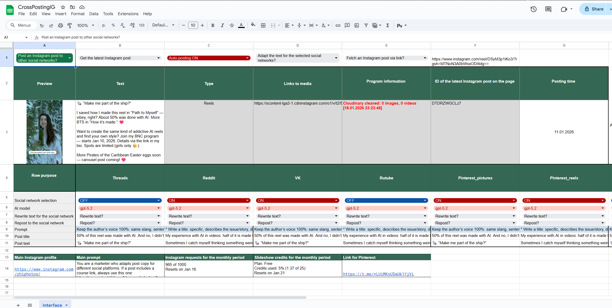
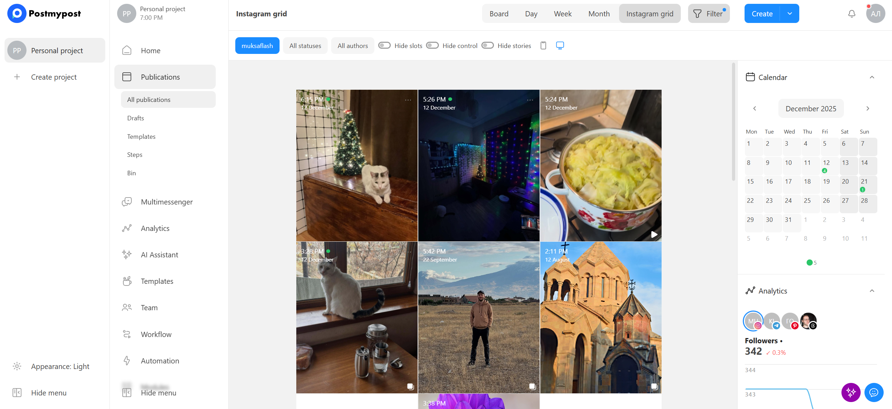

# 🤖 AI Instagram Cross-Posting System (Sheets + PostMyPost)

**My Role:** AI Automation & Integrations Developer (Google Apps Script)

I built an AI-powered Instagram cross-posting system that completely automates moving, rewriting, and scheduling content across social platforms.

## ⚡ Core Highlights

* **Automated Import**: Fetches both new and historical posts via the Instagram API.
* **AI Caption Rewriting**: Automatically tailors and rewrites captions per target platform utilizing **OpenAI**.
* **Advanced Media Pipeline**: Converts and optimizes media using **Cloudinary**, including transforming static image carousels into cohesive video slideshows.
* **Smart Publishing**: Pushes ready-to-schedule content directly to the **PostMyPost** API.
* **Centralized Control**: Employs a **Google Sheets** control panel to effortlessly manage routing rules, custom prompts, and monitor per-post statuses.

🏆 **Impact:** Reduced multi-network publishing time from **~2–3 hours** to **~15 minutes** per post.

## 📸 Interface Preview

Here are some sneak peeks of the management interface:

  

 

  

## 🛠 Tech Stack

* **Google Apps Script (GAS)**: Core runtime and control spreadsheet logic.
* **Instagram Graph API**: Data extraction.
* **OpenAI API**: Context-aware content rewriting.
* **Cloudinary API**: Dynamic media manipulation and video generation.
* **PostMyPost API**: Final scheduling and distribution.
